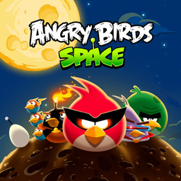

<div align="center">



# abspace_nx

**Angry Birds Space HD on Nintendo Switch**

An unofficial Nintendo Switch wrapper for the Android version of
**Angry Birds Space HD**.

[](#)
[](#)
[](#)

</div>

---

## About

`abspace_nx` is a native wrapper that runs the 32-bit ARM Android build of
**Angry Birds Space HD** on Nintendo Switch. It loads the game's own
`libAngryBirdsSpace.so` (Rovio's Fusion engine, Lua 5.1 and Box2D) and
recreates the Android, JNI, libc, audio, input and graphics services it
expects under Horizon OS. The program runs in AArch32 mode, like the game's
code, and is built with devkitARM and libnx32.

This release targets **Angry Birds Space HD 2.2.14** for Android
(`com.rovio.angrybirdsspaceHD`, version code 221400, armeabi-v7a). It ships no
game code and no game data: you supply the APK of a copy you own, and the
wrapper reads everything from it.

Additions over the Android version:

* Controller support for levels and menus, and a hand cursor.
* The shop is free, and the Froot Loops Bloopers episode (US-only on phones)
  is available.
* The game's web links open popups about their topic, with the linked videos
  streamed from YouTube when the console is online.
* The two worlds of [Angry Birds Orbital Escapade](https://gamejolt.com/games/OrbitalEscapade/1016788)
  by ShadowBird81, Vege-toids and Omelettification, as two more planets when
  the mod is on the SD card.

---

## Controls

**R** switches between the two control schemes in a level. In the menus, the
stick or D-Pad moves between buttons and the right stick brings out the hand
cursor. The touchscreen works as on a phone.

| Input | Level | Menus |
| --- | --- | --- |
| **Left Stick** | Pull back and aim | Move between buttons |
| **D-Pad** | Fine aim while pulling back; camera to slingshot or target | Move between buttons |
| **A** | Launch, use the bird's power | Press |
| **B** | Let go of the bird | Back |
| **Right Stick** | Move the camera; up/down zoom | Hand cursor |
| **L** | Camera: slingshot or target | Previous page |
| **ZL / ZR** | Zoom out / in | Previous / next page |
| **X (hold)** | Restart the level | |
| **Y** | Open or fold the power-ups bar | |
| **-** | Space Eagle | |
| **+** | Pause, resume | Resume |

Cursor controls (Angry Birds Reloaded style), after **R** in a level:

| Input | Action |
| --- | --- |
| **Left Stick** | Move the hand |
| **A / ZL / ZR** | Touch (hold to drag) |
| **B** | Back |
| **L** | Hand to the middle |
| **+** | Show or hide the hand |
| **-** | Gyro pointing on or off |
| **D-Pad Up / Down** | Hand speed |
| **USB mouse** | Moves the hand, left button touches |

Holding the stick on the planet screen keeps the planets turning, faster the
longer it is held. Videos in the popups: **A** pause, **B** stop, left stick
or D-Pad 10 seconds back or forward.

---

## Build

### Requirements

* Docker
* [android32](https://github.com/aks796/android32), the runtime shared by the
  32-bit ports, at `runtime/` (a git submodule: `git clone --recursive`)
* `ghcr.io/vita2hos/devcontainer/vita2hos` (devkitARM and libnx32) for the
  32-bit program
* `devkitpro/devkita64` for the launcher
* [libnx32](https://github.com/aks796/libnx32) 4.12.0 or newer, the 32-bit
  libnx. The build finds its `prefix/` next to this folder
  (`../libnx32/prefix`), or where `DCR_LIBNX32` says
* [mesa32](https://github.com/aks796/mesa32), Mesa and libdrm_nouveau: its
  `lib/` and `include/` copied into `portlibs32/`
* The FFmpeg 7.1.1 source, for the video decoders (optional)

libnx32 and mesa32 have prebuilt releases, which work as well as building them.

Build the libraries once. mbedTLS comes from the tarball in `tools/mbedtls/`;
FFmpeg reads an unpacked ffmpeg-7.1.1 (`FFMPEG_SRC` names it):

```bash
tools/mbedtls/build.sh
FFMPEG_SRC=/path/to/ffmpeg-7.1.1 tools/ffmpeg/build.sh
```

Compile the 32-bit program (`abspace_nx.nsp`) and the launcher
(`launcher/abspace_nx.nro`, which carries the program in its RomFS):

```bash
./build.sh
launcher/build.sh
```

Or build both and lay out the SD card in `SD_CARD/` and `SD_CARD.zip`:

```bash
tools/package_sd.sh
```

`tools/verify_lua_api.py` checks an APK against the Lua addresses the
controller bridge uses. `tools/orbital/setup.sh` builds a host test of the
Orbital Escapade code against the game's own scripts. See `NOTES.md` for the
library changes and porting notes.

---

## Running

Requirements: a Switch with Atmosphère and sphaira.

Create this folder on the SD card and put both files in it:

```text
sd:/switch/abspace_nx/
├── abspace_nx.nro
└── com.rovio.angrybirdsspaceHD_2.2.14.apk
```

The APK's file name does not matter as long as it ends in `.apk`. The wrapper
picks the APK that holds the game's library.

1. In sphaira: **Homebrew > Angry Birds Space > Install Forwarder**.
2. Launch the new **Angry Birds Space** icon on the HOME menu. The first
   launch installs the game program for that icon (an ExeFS override in
   `sd:/atmosphere/contents/`), restarts, and unpacks the game's library from
   the APK. It shows its progress on screen.

A 32-bit program cannot run as an NRO, since hbloader is 64-bit. The NRO is a
launcher that installs the game program for its forwarder's icon.

To update, replace `abspace_nx.nro`. The game installs the newer build itself
and restarts. To undo, delete the `exefs.nsp` the launcher wrote.

Updating from a build that used `sd:/switch/abspace/`: copy `abspace_nx.nro`
into that old folder and start the game from its usual icon. It updates
itself, then moves the APK, settings, saves, videos and mod into
`sd:/switch/abspace_nx/`. The old `AngryBirdsSpace.nro` stays behind.

### Angry Birds Orbital Escapade

Download the mod from [Game Jolt](https://gamejolt.com/games/OrbitalEscapade/1016788),
extract it on a computer, and copy its `data` folder (or the whole extracted
folder) into `sd:/switch/abspace_nx/`. The wrapper finds the mod by its
contents. Its two worlds appear after Danger Zone, with the mod's prototype
birds in those worlds only.

The mod is the whole PC game (137 MB). After the first launch with it, the
wrapper removes the files its two worlds do not use, leaving about 22 MB.

### Files

```text
sd:/switch/abspace_nx/
├── abspace_nx.nro
├── <your APK>
├── config.ini
├── libAngryBirdsSpace.so
├── classes.txt
├── data/
├── videos/
├── debug.log
└── crash.log
```

Settings live in `config.ini`, which is written on the first launch and
explains each option in place. Saves live in `data/files/`. Offline copies of
the linked videos go in `videos/` (see `videos/README.txt`).

---

## Status

Levels, menus, controller and touchscreen input, audio, the free shop, the
Froot Loops Bloopers episode, the link popups with streamed videos, and the
Orbital Escapade worlds work on hardware.

Rovio's online services are offline: accounts, cloud saves, news and ads do
not work. The mod's changes to the PC game's own levels are not used.

The wrapper is built for **Angry Birds Space HD 2.2.14** for Android,
armeabi-v7a. Other versions have not been tested. With another version the
controller bridge turns itself off, and only the touchscreen and the hand
cursor work.

---

## Credits

**Angry Birds Space Nintendo Switch port**: aks796

**Angry Birds Space**: Rovio Entertainment

**Angry Birds Orbital Escapade**: ShadowBird81,
[gamejolt.com/games/OrbitalEscapade/1016788](https://gamejolt.com/games/OrbitalEscapade/1016788)

The 32-bit toolchain and libnx32 come from
[vita2hos](https://github.com/xerpi/vita2hos) by xerpi. The `.so` loader
derives from the open-source Switch loader work by Andy Nguyen
(TheOfficialFloW) and fgsfds. The cursor controls follow the Switch port of
Angry Birds Reloaded.

The videos are streamed from YouTube: the Rocket Science Show, NASA's "Angry
Birds in Space" and "Driving Miss Curiosity", the launch trailer, and Angry
Birds Toons.

Built with devkitPro, libnx, Mesa, FFmpeg, Mbed TLS and miniz. See `LICENSE`.

---

## Contributing

Bug reports and tested improvements are welcome. Include the build number,
steps to reproduce, and `debug.log`, `config.ini` and, if the game closed by
itself, `crash.log` from the game folder.

---

## Disclaimer

This is an unofficial fan project and is not affiliated with, sponsored by or
endorsed by Nintendo or Rovio Entertainment. Angry Birds and all related
characters and trademarks belong to Rovio Entertainment.

No game code or data is included. You need your own copy of the game's APK.
